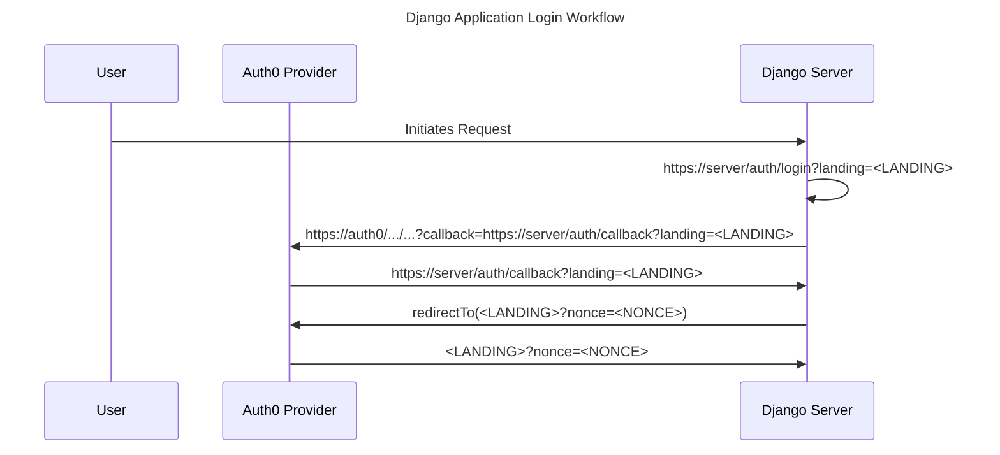

# Auth1: Auth0 Integration

The legacy `POST /app/auth1/session` claims relay is retired and returns
HTTP 410 with code `DIRECT_SESSION_RETIRED` and the configured backend login URL.
Posted identity dictionaries and the legacy `CLIENT_SESSION_API_KEY` cannot mint
or replace a session. This security boundary applies immediately, without an
insecure compatibility flag. Existing clients of that relay must switch to the
backend OAuth authorization-code flow; the current web and CLI already use it.

Begin at the backend `login` route. Authlib verifies the state-bound callback and
provider token before user registration, auto-join, group synchronization or
session creation. Existing verified sessions, CLI device approval and their
normal bearer/session admission continue to work. Do not roll back to unverified
claim admission; there is no safe legacy fallback.

